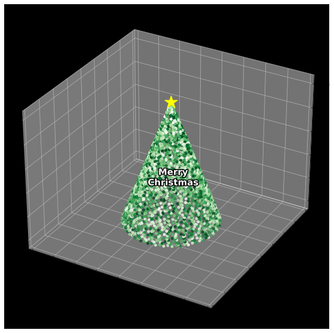

# Christmas Tree

KT Aivle 1기 크리스마스 이벤트에 참가하기 위해 제작한 크리스마스 트리입니다.

numpy와 matplot을 이용하여 3D 그래프를 그렸습니다. 트리는 매개변수 방정식을 활용하여 나선의 그래프를 그리고 마커를 이용하여 잎을 표현했습니다. 트리의 꼭대기에 마커를 이용해 별을 달고 트리의 가운데에 Merry Christmas 라는 글자를 새겼고, 가독성 향상을 위해 patheffects를 이용하여 글자 테두리를 만들었습니다.

2021년 12월 22일 제작하였습니다.

## License

© Youngcheor Ra